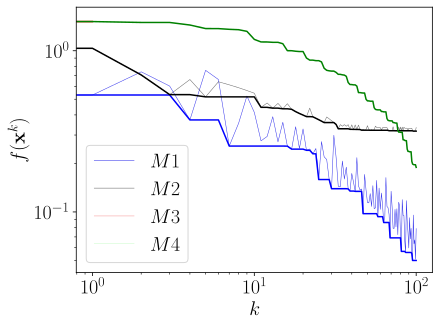

# MISSA
Source code for the numerical experiments in the paper "A Markovian Incremental Stochastic Subgradient Algorithm" by Rafael Massambone, Eduardo F. Costa, and Elias S. Helou.

<p align="center">
  
  

  <a href="https://github.com/tgmarinho/README-ecoleta/commits/master">
    
  </a>
    
   

## Paper

The paper "Markovian Incremental Stochastic Subgradient Algorithms" (MISSA) addresses a new algorithm for minimizing a sum of convex functions. The method uses partial subgradient information sequentially, with index selection performed by a general Markov chain. Its formulation allows application in agent networks where the information flow path is stochastically selected. We prove the convergence of the algorithm to a weighted objective function where the weights are given by the limit probability distribution, in the Cesàro sense. Unlike previous works in the literature, the Cesàro limit distribution is general (not necessarily uniform), allowing for weighted general objective functions and method flexibility. The preprint can be found at https://arxiv.org/abs/2108.07900.

## Como executar

This project features four implemented methods:
1. MISSA (programa principal: missa.cpp)
2. Cyclic incremental stochastic subgradient algorithm (main program: cyclic.cpp)
3. Randomized incremental stochastic subgradient algorithm (main program: randomized.cpp)
4. Markov randomized incremental stochastic subgradient algorithm (main program: ram.cpp)

MISSA executes subiterations in parallel using the std::thread library https://en.cppreference.com/w/cpp/thread/thread. In this program, we implement two Markov chains  taking values in a transition matrix . You can modify this according to your needs in missa.cpp.

```bash

# To compile
$ g++ -O3 -Wl,--no-as-needed -std=c++11 -lpthread missa.cpp -o missa

# To run
$ ./missa <numero-iteracoes> <numero-cadeias=2> <numero-threads=2>

```
As a result, the program will print the CPU time for MISSA in each of the eight tests performed. Additionally, files "/home/objective_MISSA_test-1.txt", ..., "/home/objective_MISSA_test-8.txt" will be generated in $HOME with the values of  for each test. Change the destination directory for the files according to your preference.
  
The other methods use only one Markov chain. They can be compiled and executed with

```bash

# To compile
$ g++ -O3 -Wl,--no-as-needed -std=c++11 -lpthread cyclic.cpp -o cyclic
$ g++ -O3 -Wl,--no-as-needed -std=c++11 -lpthread ram.cpp -o ram
$ g++ -O3 -Wl,--no-as-needed -std=c++11 -lpthread randomized.cpp -o randomized

# To run
$ ./cyclic <numero-iteracoes> <numero-cadeias=1> <numero-threads=1>
$ ./ram <numero-iteracoes> <numero-cadeias=1> <numero-threads=1>
$ ./randomized <numero-iteracoes> <numero-cadeias=1> <numero-threads=1>

```

After running all methods, you may want to view a graph of the results. By typing
  
```bash
  
  $ python3 graphs_diminishing_all_best.py
  
```
the file "teste1-fig.svg" will be generated as output. You can modify the code to visualize the graph for the other tests.
  

  
## License

This project is licensed under  [](https://creativecommons.org/licenses/by-nc-nd/4.0/)
